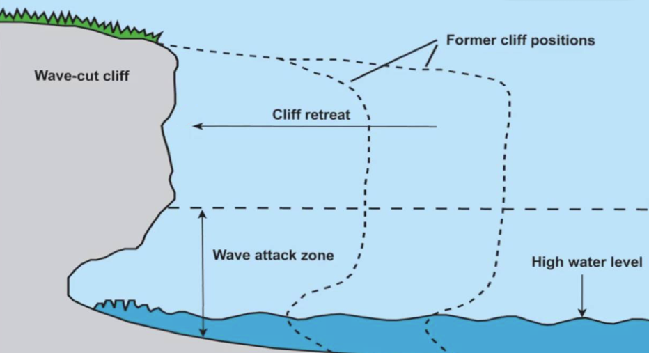
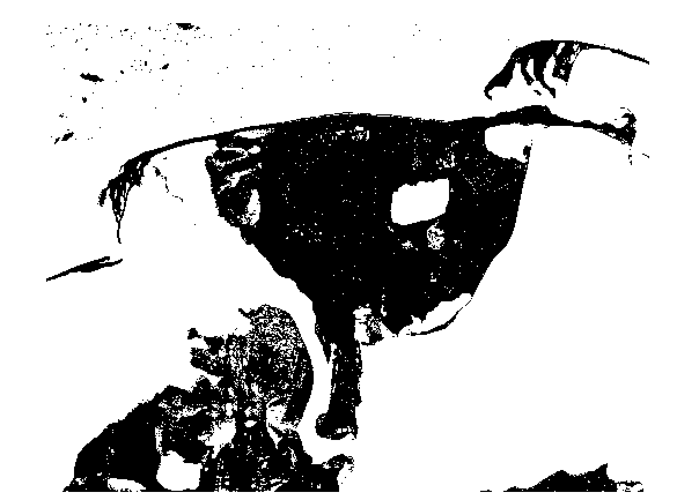
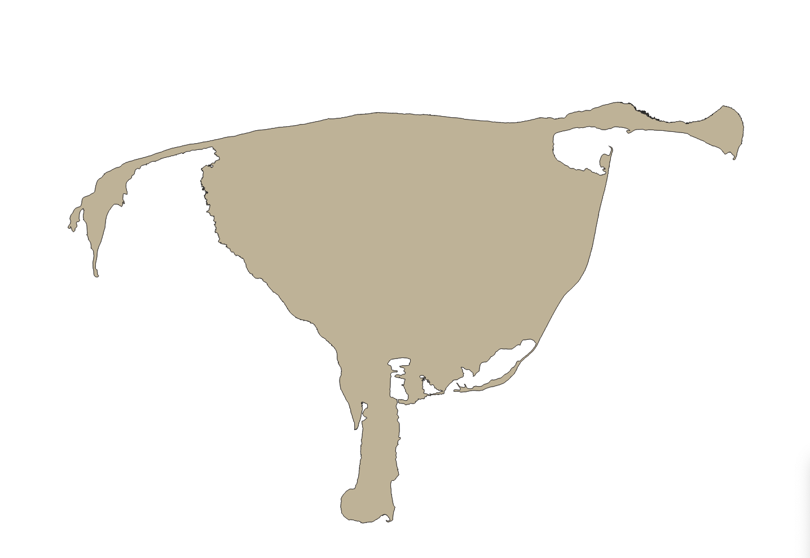

## Welcome to SatelliteCoastlineNet


_Coastal Bluff Eroding_ [1]

## Why Automate the Delineation of a Costal Bluff?
Current practices regarding the “Manual” delineation of coastal bluffs take an enormous amount of time to produce results that are not sufficiently accurate, as can be seen by an exploded view of the satellite image pixels. Climate scientists are tracing and labeling the coastal bluffs by hand in order to measure the erosion of the coast over time. Delineation of the coastline and thaw features has been identified and mapped out using ArcGIS/QGIS, a cloud-based mapping and analysis solution. ArcGIS has been commonly used for viewing and analyzing large satellite data images. The researchers have used ArcGIS/QGIS to expand the satellite images of the coastal bluffs in Alaska to almost 3000 times the original size to identify the colors of the image pixels. Researchers distinguish the coastline by manually differentiating the colors of the pixels and tracing along the differentiation. This process is highly susceptible to human error, as the difference in color is subjective to the researcher’s perspective. Additionally, this practice is highly tedious and time consuming, as the resolution of the image only allows for a few meters of coastline to be hand-traced at a time. There is a need for a way to do this work that is not so tedious and time-consuming. A method should be used that can trace coastal bluff erosion from satellite imagery that is highly accurate and not as labor intensive as the current manual practices. Developing an automated procedure to segment images and classify pixel hues would allow researchers to apply this to current satellite imagery.   

## Satellite Coastline Network 
Description: Application for a CNN-Supervised Classification of remotely sensed imagery with deep learning. 

### Dependencies 
* Keras (Tensorflow-GPU v1.14 as the backend) 
* Sciki-Learn 
* Imbalanced-Learn tool box
* Scikit-Image 
* Pandas 

### Basic Installation 
After installing dependencies, the application can be tested with the instructions, data and base model provided. 

### Data Preparation 

In order to generate coastline extraction results with higher resolution, [WorldView-2 Satellite](https://www.satimagingcorp.com/satellite-sensors/worldview-2/) image products were used to identify the boundary between land and open water for Kaktovik and Wainwright, Alaska. We recommend that the data be structured as: CoastlineName_Number.jpg. The number must be at least 4 digits (CoastlineName_0022.jpg), but can be more if nessesary (exampe 5-digit, CoastlineName_12345.jpg). The associated classification is expected to have the same filename but with a prefix of 'CSC_' and a tif format (CSC_CoastlineName_0022.tif). The default number of classes in the code and in the label data found on the repository is 2: water and land. Users can alter the number of classes for other studies as needed. However, all the code and models function by tiling the input imagery in sub-images of 50x50 pixels.

#### QGIS and ArcGIS Data Symbology 
Developing our training data involved conversion of a standard satellite TIFF image and altering the symbology in such a way that it is easier to classify and parse the geometry of the coastline. The entirety of our training data development was performed in QGIS, an open source geographic information system application that supports the viewing, editing, and analysis of geospatial data. In QGIS, the uneditied TIFF image from a particular location and year provided from Worldview served as our input image. The main outputs of our QGIS algorithm are a TIFF image with a binary classification of "water" and "land", and the coordinates of the coastline from the TIFF image as a GEOJSON file. The steps to complete each set of training data are as follows:

1. Load TIFF image from PIPER Imagery as a raster layer
2. Clip the image to reduce the possiblity of excess noise and unwanted features
3. Change the symbology by grayscaling the image
4. Apply an expression to classify the image into two separate pixel categories denoting water and land


_Classified image of example TIFF file_[2]

5. Vectorize the image into a shapefile and select the main feature (Kaktovik or Wainwright)
6. Use the "delete holes" functionality to remove all classifications of water within the main feature. This helps reduce the amount of data we have and makes it easier to deliniate the coastline. Image below displays the final image:
7. Export the coordinates of the entirety of the feature as a GEOJSON file.

_Isolated land feature with coastline as main land/water separation_[3]

#### Image Loading and Data Preparation Section
Images (.jpg) and Class Label Masks (.tif) are extracted from the TRAIN folder.  
1. Tiles the images into a 4D tensor (nTiles,Width,Height,Bands) format
2. Observes classification mask, when tile is 90% classified, produces a label vector value, zero if less than 90%
3. Feeds the following into the Keras base model convnet, level of trainaibility of the convnet can be set by the user (supervised)
4. Accuray,loss checks, epochs are reviewed and when tuning is satisfactory, the model can be saved for the CNN 

```Python
#Glob list fo all jpg images, get unique names form the total list
img = glob.glob(TrainPath + "*.jpg")

#Get training class images
class_img = glob.glob(TrainPath + "CSC_*.tif*")
```

### Convolutional Neural Network (CNN) Training 
After data preparation, the script TrainCNN.py can be used to train the Keras H5 base model architecture with pretrained weights as downloaded. User options are at the start. Elements marked 'Path' or 'Empty' need to be edited. It is recommended to set the ModelTuning variable to True and run the tuning procedure for the CNN. This will output a figure and the correct number of tuning epochs can be set as the point where the loss and accuracy of the validation data begin to diverge from the loss and accuracy of the training data. Once this is established, the script must be run again with ModelTuning set to False and the correct value for Tuning. This will save the Keras model with a .h5 extension and it will also save a class key as a small csv file. Once these options are edited in the code no switches are required. 

#### Convnet Section

```Python
#Setup the convnet and add dense layers
model = models.Sequential()
model.add(conv_base)
model.add(layers.Flatten())
model.add(layers.Dense(256, activation='relu', kernel_regularizer= regularizers.l2(0.001)))
model.add(layers.Dropout(0.5))
model.add(layers.Dense(128, activation='relu', kernel_regularizer=regularizers.l2(0.001)))
model.add(layers.Dense(LabelTensor.shape[1], activation='softmax'))

#Tune Optimizer 
Optimizer = optimizers.Adam(lr=0.001, beta_1=0.9, beta_2=0.999, epsilon=None, decay=0.0, amsgrad=True)

#Compile and display the model          
model.compile(optimizer=Optimizer,loss='categorical_crossentropy', metrics=['acc'])
model.summary()

#Fit all the data for transfer learning and train the final CNN
model.fit(ImageTensor, LabelTensor, batch_size=BatchSize, epochs=TrainingEpochs, verbose=1)
```

### Convolutional Neural Network (CNN)- Supervised Classification (CSC) Execution 
After development of trained CNN model, CSC performance can be evaluated with CnnSupervisedClassification.py. The images to test must follow the same naming convention and all have an existing set of manual labels as used in the CNN training phase above. Again variables currently set to 'Path' or 'Empty' must be edited in the code. The CSC is currently set to use a Multilayer Perceptron (MLP) to perform the phase 2, pixel-level, classification. In this phase, the CNN classification output for a specific image will be used as training data for that specific image. The script will execute and output performance metrics for each image. csv files with a CNN_ prefix give performance metrics for the CNN model with F1 scores and support (# of pixels) for each class. MLP_ files give the same metrics for the final CSC result after the application of the MLP. A 4-part figure will also be output showing the original image, the existing class labels, the CNN classification and the final CSC classification labelled either MLP. Optionally, a saved class raster can also be saved to disk for each processed image.

#### CnnSupervisedClassification Dense classifiers

```Python
#Define deep the model with L2 regularization and dropout
def deep_model_L2D():
    #Create model
    model = Sequential()
    model.add(Dense(256, kernel_regularizer= regularizers.l2(0.001), input_dim=Ndims, kernel_initializer='normal', activation='relu'))
    model.add(Dropout(0.5))
    model.add(Dense(128, kernel_regularizer= regularizers.l2(0.001), kernel_initializer='normal', activation='relu'))
    model.add(Dropout(0.5))
    model.add(Dense(64, kernel_regularizer= regularizers.l2(0.001), kernel_initializer='normal', activation='relu'))
    model.add(Dropout(0.5))
    model.add(Dense(32, kernel_regularizer= regularizers.l2(0.001), kernel_initializer='normal', activation='relu'))
    #model.add(Dropout(0.5))
    model.add(Dense(32, kernel_regularizer= regularizers.l2(0.001), kernel_initializer='normal', activation='relu'))
    #model.add(Dropout(0.5))
    model.add(Dense(NClasses, kernel_initializer='normal', activation='softmax'))

    #Tune an optimizer
    Optimizer = optimizers.Adam(lr=LearningRate, beta_1=0.9, beta_2=0.999, epsilon=None, decay=0.0, amsgrad=True)

    #Compile model
    model.compile(loss='sparse_categorical_crossentropy', optimizer=Optim, metrics = ['accuracy'])
    return model

#Define the very deep model with L2 regularization and dropout
def very_deep_model_L2D():
   #Create model
    model = Sequential()
    model.add(Dense(512, kernel_regularizer= regularizers.l2(0.001), input_dim=Ndims, kernel_initializer='normal', activation='relu'))
    model.add(Dense(256, kernel_regularizer= regularizers.l2(0.001), kernel_initializer='normal', activation='relu'))
    model.add(Dropout(DropRate))
    model.add(Dense(128, kernel_regularizer= regularizers.l2(0.001), kernel_initializer='normal', activation='relu'))
    model.add(Dense(128, kernel_regularizer= regularizers.l2(0.001), kernel_initializer='normal', activation='relu'))
    model.add(BatchNormalization(axis=-1, momentum=0.99, epsilon=0.001, center=True, scale=True, beta_initializer='zeros', gamma_initializer='ones',  		   
    moving_mean_initializer='zeros', moving_variance_initializer='ones', beta_regularizer=None, gamma_regularizer=None, beta_constraint=None, gamma_constraint=None))
    model.add(Dense(64, kernel_regularizer= regularizers.l2(0.001), kernel_initializer='normal', activation='relu'))
    model.add(Dense(32, kernel_regularizer= regularizers.l2(0.001), kernel_initializer='normal', activation='relu'))
    model.add(Dropout(DropRate))
    model.add(Dense(32, kernel_regularizer= regularizers.l2(0.001), kernel_initializer='normal', activation='relu'))
    model.add(Dropout(DropRate))
    model.add(Dense(NClasses, kernel_initializer='normal', activation='softmax'))

    #Tune an optimizer
    Optimizer = optimizers.Adam(lr=LearningRate, beta_1=0.9, beta_2=0.999, epsilon=None, decay=0.0, amsgrad=True)

    #Compile model
    model.compile(loss='sparse_categorical_crossentropy', optimizer=Optim, metrics = ['accuracy'])
    return model
```
### Preprocessed Satellite Images with QGIS 
We learned that processing multi-spectral images/panachromatic images need to be properly cropped,georeferenced, and classified for training and validation data. We received data products for Kaktovik and Wainwright from 1950-2019 and the data preparation took around 10-12 hours of supervised manual labor. Furthermore, the following training/validation data needs to be verified with the [Geophysical Institute Permafrost Laboratory](https://permafrost.gi.alaska.edu/). 

### Takeaways 
1. Future implementation with large data sets require low resolution (ex. [Sentinel-2](https://eos.com/find-satellite/sentinel-2/) 10m), but don't capture erosion rates compared to WorldView-2 high resolution data products received.
2. Supervised CNN requires experience with ArcGIS/QGIS (10-12 hours)
3. TrainCNN.py will require supervised validation of accuracy/loss.


### References
[1] https://i.ytimg.com/vi/A5VoTgwEsWE/maxresdefault.jpg
